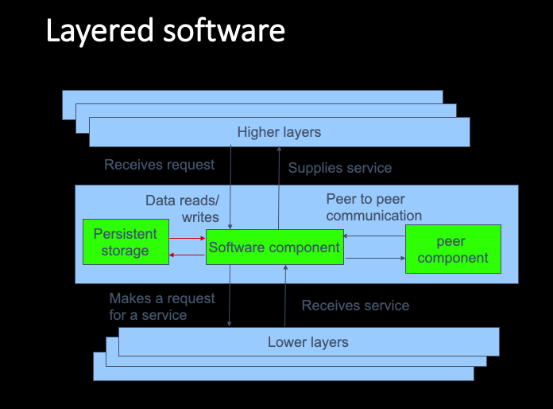

# Software Project Manangement

## Module 2 : Stepwise Approach For Project Evaluation

- [x] ~~Planning the software project~~
- [x] ~~Product break down structure for identifying the project activities~~
- [x] ~~Strategic Assessment~~
- [x] ~~Technical Assessment~~
- [x] ~~Cost Benefit Evaluation Techniques~~
- [x] ~~Risk Evaluation~~

## Project Evaluation

1. Establish Project Scope, Objectives, and Parties Involved.
2. Identify project infrastructure, planning, team, and install procedures.
3. Analysis of Project Characteristics and select life cycle approach.
4. Identify project activities and products.
5. Estimate effort for each activity, Revise plan to create controllable activities.
6. Identify activity, risks, and mitigate them.
7. Allocate Resources and revise plans
8. Review plan, prepare agreement

## Planning the software Project

1. Strategic Planning : Perform Cost Benefit Analysis.
2. Feasibility Study : Does benefts outweight the costs.
3. System Specification : Estmates of the system design and approximation is done.
4. Evaluation of suppliers proposal : System and Subsystem tender for the client.
5. Project Planning : Detailed implementation after planning and estimation.

## Product break down structure for identifying the project activities

- https://www.geeksforgeeks.org/activity-identification-approaches-in-software-engineering/

## Strategic Assessment

- Assess long term strategy
- Carried out by upper management
- Check whether project meets the defined requirements.
- Compare plan with overall business objectives
- Suitable for projects developed for other organizations

## Technical Assessment

- Validate hardware or software requirements of the project
- Check the functionality and correctness of the project

## Cost Benefit Evaluation Techniques

- Estimating the costs and benefits of carrying the projects and its operation.
- Cost can be of 3 types:
  1. **Development Costs** : Salaries and other employment cost.
  2. **Setup Cost** : Cost of putting the system into place.
  3. **Operating Cost** : Cost of maintaining the system and running it after installation.

### Cash Flow Forecasting

- Cost benefit analysis involves forcasting of cash flows that will take place.
- It depends upon the following : Expenditure, Income, Time.
- **Net Profit** = `Total Income` - `Total Costs`.
- **Payback Period** : Period of time to repay the initial investment.
- **Return on Investment (ROI)** : Compares net profitability to the investment required.
  - ROT = (Avg annual profit / Total investment ) \* 100
  - Average Annual profit = (Total Profit for all years / Total Number of years) \* 100
- **Net Present Value** = `(Value in year 't')` / `(1+r)^t`
- **Discount Factor** = `1` / `(1+r)^t`

## Project Risk Matrix

## Risk Evaluation

-

## Basis of Software Estimation

1. **Need for Historical Data** : Past implementation details
1. **Measure of Work** : Lines of Code
1. **Find Measures of Complexity** : Compare design, code and algorithm complexity.

## Effort Estimation Techniques

- Estimation of project parameters is important.
- Parameters include:
  - Project Size
  - Effort required
  - Project duration
  - Cost
- Accurate estimation is vital for planning and scheduling.
- Following techniques are available for estimation:
  1. **Empirical** : Making educated guess of the parameters. Past data is required for similar projects.
    - Expert Judgement
  2. **Heuristic** : Relationship between project parameters exist with some mathematical expression. Dependent variables can be known by substituting the value of independent parameters to estimate the effort.
    - COCOMO (Constructive Cost Model)
  3. Analytical : Derive results with some general assumptions.

## Effort Estimation Models

- **Algorithmic Models** : Effort Drivers representing characteristics and environment of the system to predict effort.
- **Expert Judgement** : Solicit advice of a knowledgeable staff.
- **Analogy** : Similar project is selected and compared to the current one.
- **Parkinson** : Identify the staff effort available.
- **Price to Win** : Lowest figure wins the contract.
- **Top Down** : Overall estimate is calculated and then project is broken down to reveal more efforts needed.
- **Bottom Up** : Components are identified and size of the estimates are added up.

## Bottom up estimation

- Used when no previous data is available.
- Time consuming.
- Identify all tasks that needs to be completed.
- Estimate costs for the lowest level activities.
- Add estmates as you aggregate components.

## Top down Estimation

- Produce overall estimate
- Break the program down into simpler modules
- Past data is available to estmate a ballpark figure.
- Then after analysing the lower level activities, calculate close estimate.

## COSMIC Function Points

- Measure software size
- Esimates development effort, project duration and more.
- Uses principles such as: Layering where project is structured into layers, scope of software depends on the measurement of the layer.

## COCOMO (Constructive Cost Model)

- Heuristic estimation technique
- Implies that size is primary factor for cost, and other factor have lesser known effect.
- Constructive implies the complexity of the project.
- 3 Stage estimation where rough estimate is made in 1st stage, and then it is refined in the next two stages.
- Formula for effort in Basic COCOMO Model is : Effort = `c * size ^ k`
  - Where `c` and `k` depends on the size of the system.
  - `size` is measured in KLOCs or Thousand Lines of Code.

