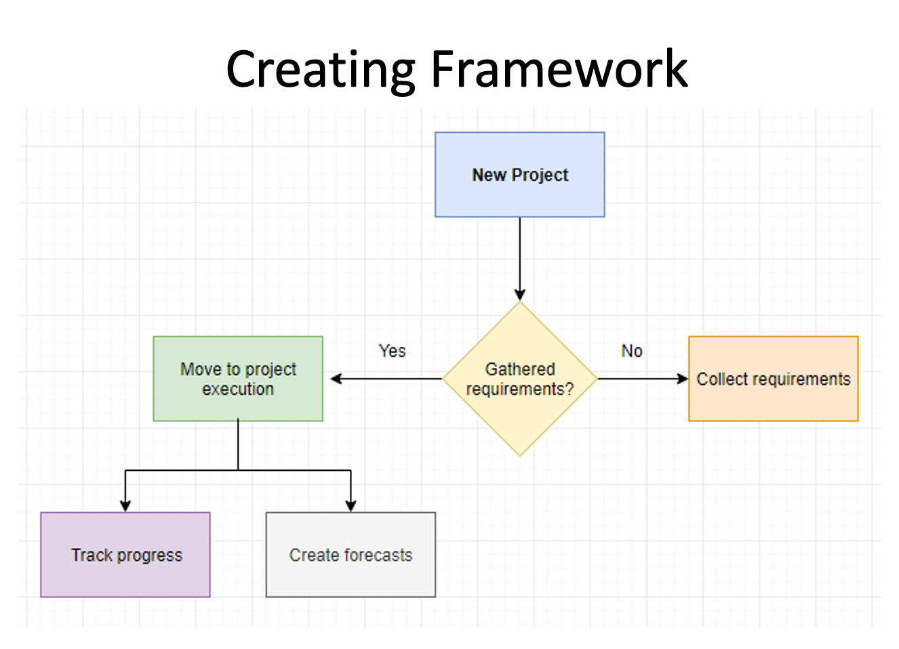

# Software Project Manangement

## Module 5 : Monitoring

- Creating a Monitoring framework
- Collecting data for monitoring
- Visualizing the progress
  - Gantt Charts
  - Time Sheets
  - Activity Assessment Sheets
- Cost Monitoring
- Earned Value Analysis

## Creating a Monitoring framework

1. Decide a new project.
2. Gather the requirements if not already collected.
3. Start the project's execution.
4. Track the progress of the project.
5. Create forcasts and estimate time and budget.

## Collecting data for monitoring

- 

## Visualizing the progress

-

### Gantt Charts

-

### Time Sheets

-

### Activity Assessment Sheets

-

## Cost Monitoring

-

## Earned Value Analysis

-
