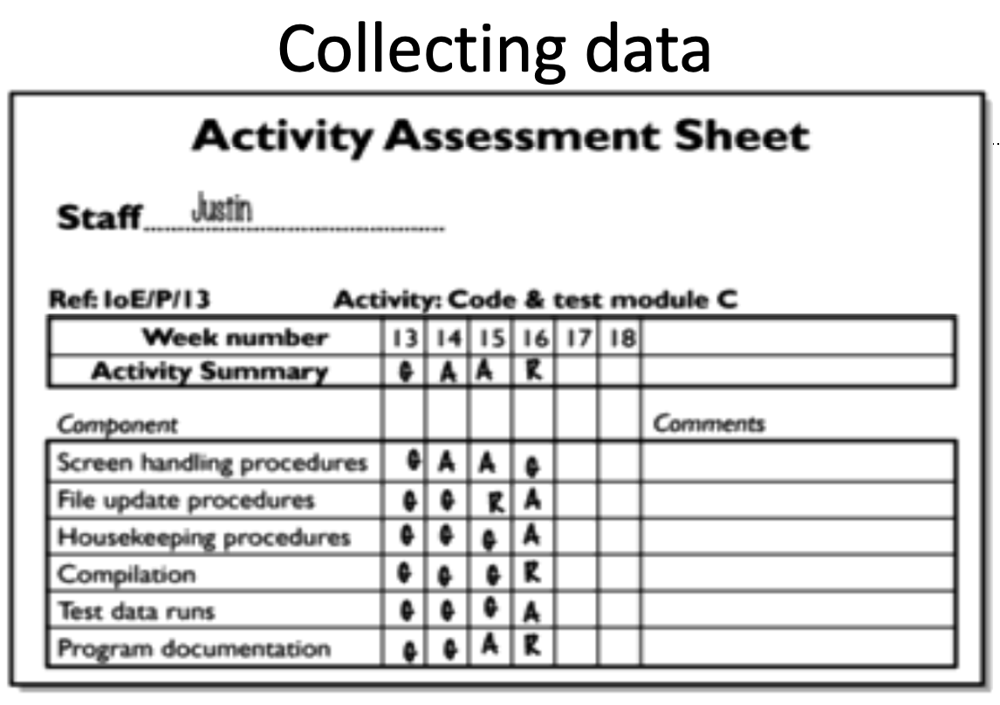

# Software Project Manangement

## Module 5 : Monitoring

- Creating a Monitoring framework
- Collecting data for monitoring
- Visualizing the progress
  - Gantt Charts
  - Time Sheets
  - Activity Assessment Sheets
- Cost Monitoring
- Earned Value Analysis

## Creating a Monitoring framework

1. Decide a new project.
2. Gather the requirements if not already collected.
3. Start the project's execution.
4. Track the progress of the project.
   1. Compare the progress against the target.
   2. Check if the target is achieved and project exceeds decided quality.
   3. If not, refine the quality of the project.
5. Create forcasts and estimate time and budget.
6. End the project and create reports.
7. Document conclusions.

## Reporting

-

## Categories of Reporting

| Report Type             | Examples                     | Comment                                        |
| ----------------------- | ---------------------------- | ---------------------------------------------- |
| Oral, formal            | Timely Meetings              | Reporting is oral, but minute writing is done. |
| Oral, formal, ad-hoc    | Stage-end Meetings           | Reporting is oral, but minute writing is done. |
| Oral, informal          | Social Interaction           | Must be noted in a formal writing              |
| Written, formal         | Job sheets, Progress Reports | Timely documentation using forms.              |
| Written, formal, ad-hoc | Exception Reports            |                                                |

## Partial Completion Reporting

- Weekly timesheets are generally used for partial completion reporting.
- Provides information about what is completed and what is pending.
- Consists of rechargable and non-rechargable hours
- Rechargable hours include:
  - Project
  - Activity code
  - Description
  - Percent Complete
  - Schedule
  - ETA
- Non Rechargable hours include:
  - Code
  - Description
  - Hours
  - Comment

## RAG Status Reporting

- Used when we have to indicate how well a project is doing.
- The colors indicate some problems
  - Red : Problem
  - Amber : Okay
  - Green : Good
- Give indication to upper management easily and quickly.

## Visualizing the progress

### Gantt Charts

- A type of bar chart that shows a project structure.
- Shows what progress has been made by whom in what time.
- Also depicts the ordering of the tasks in a project.

